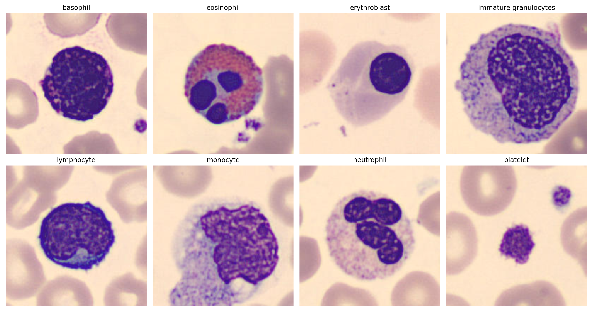

# Artificial Neural Networks and Deep Learning 2024

---

## Homework 1: Blood-cell classification

### Team Members
- Maria Aurora Bertasini*
- Marco Cioci*
- Francesco Rosnati*
- Luca Tramacere*

*Master's candidate in High Performance Computing Engineering at Politecnico di Milano

## Content
The homework was focused on classifying eight specific classes of blood cells. We adopted a systematic trial-and-error approach to iteratively develop a convolutional neural network (CNN) model capable of achieving high accuracy. 

### [Report](./Report_homework1_YNWA.pdf)
Refer to this document for additional information.



## Introduction

---

### Template Notebook
This notebook serves as a foundational template that outlines the workflow followed throughout the project. It provides an overview of the core steps involved in our process and includes links to more detailed, dedicated notebooks that focus on the key aspects of the project. Please note that **this template is not intended to be executed directly**. Instead, it serves as a reference to guide the reader through the structure and approach used. 

### Final model
[Final Model Notebook](./FinalModel.ipynb) presents the final version of our model, that resulted in a 0.94 accuracy on Codabench Leaderbord.

The model consist on a Transfer Learning approach that uses `EfficientNetB2` as backbone feature extractor. The classificator is composed of three medium-light dense layers (512, 256, 128), with proper batch normalizations and regularizations. 

The good results depend mainly on two focal aspects:
- heavy application of **augmentations**, especially from KerasCV library, to allow our models to generalize well beyond the limit imposed by the starting dataset
- a thorough journey in the choice of the best **fine-tuning** so that it could learn the best weights possible for the problem at hand


## Work environment

---
### Manage Colab Environment
```python
COLAB = False

if COLAB:
    !pip install keras_cv -qq
    from google.colab import drive
    drive.mount('/gdrive')
    %cd /gdrive/My Drive/ANN_new
```


### Imports

```python
import numpy as np
import tensorflow as tf
import keras_cv as kcv
from tensorflow.keras.applications import """BASE MODEL"""
from tensorflow.keras.applications."""BASE MODEL""" import preprocess_input
from tensorflow.keras.models import Model
from tensorflow.keras.layers import Dense, Input, GlobalAveragePooling2D, Dropout, BatchNormalization, Resizing, Rescaling, LeakyReLU, ELU
from sklearn.model_selection import train_test_splitBuild, Create, Compile
from tensorflow.keras.callbacks import EarlyStopping, ModelCheckpoint
from sklearn.utils.class_weight import compute_class_weight


SEED = 42

```
## Preprocessing

[Preprocessing Notebook](./DatasetPreparation.ipynb): thorough description of the steps applied are shown in a dedicated environment, available at the link. 

---

Data required preprocessing before the actual ideation of the Neural Network could begin. In particular the dataset had a large number of *unwanted data*.
- Starting data, input of the preprocessing notebook: `data/training_set.npz`
- Processed data, output: `data/training_set_clean.npz`

In the present notebook data are uploaded **already preprocessed** in the following cell.
### Load the dataset already cleaned from unwanted data

```python
data = np.load('data/training_set_clean.npz')
X = data['images']
y = data['labels']
```
## Augmentations

[Augmentations Notebook](./Augmentations.ipynb) provides a detailed overview of all the *keras_cv* augmentations tested.

---
During the development of the project a large number of augmentations were experimented with. They come from two sources:
- *Keras Image augmentation layers* (included in Keras by default)
- *Keras_cv Augmentation Layers* (additional library)
#### Keras Image Augmentation Layers
Following empirical testing to determine which ones would consistently prove useful, a group of five layers was selected and established as the foundational augmentations. 
From that point onward, all additional augmentations were applied on top of these base layers:

```python
augmentation = tf.keras.Sequential([
    tf.keras.layers.RandomFlip('horizontal'),
    tf.keras.layers.RandomRotation(0.7),
    tf.keras.layers.RandomBrightness(0.2),
    tf.keras.layers.RandomTranslation(height_factor=0.15, width_factor=0.15),
    tf.keras.layers.RandomZoom(0.3)
])
```

#### Keras_cv Augmentation Layers
For more complex and heavily distorting augmentations, the task was delegated to the more versatile and feature-rich *keras_cv* library, which provided greater flexibility and variety in data augmentation. Watch the dedicated notebook previously linked to find out more. It allows users to visualize the effects of each augmentation individually, examine the outcomes of various combinations, and review the pipelines actively employed throughout the project's development. 


The augmentations are conveniently stored in a proper [python module](./py_modules/KerascvAug.py), once defined the desired ones they are to be inserted in the augment function below, which will later be applied during *Data Preparation* step.
# import all augmentations and defined pipelines
from py_modules.kerascv_aug import *

```python

# ------------------------- #
# Define pipeline/s
# ------------------------- #
# ...
# ...
   


def augment(images, labels):
    
    
    # Ensure images are tensors of the desired type
    images = tf.cast(images, tf.float32)


    # ------------------------- #
    # Apply augmentations here
    # ------------------------- #
    # ...
    # ...
    

    return images, labels

```

## Transfer Learning

---
### Before Transfer Learning: custom CNNs
Initially, our approach was to build models from scratch, but it quickly became apparent that this strategy was much less efficient and powerful compared to leveraging pre-trained base models available in Keras. As a result, custom CNNs were soon abandoned in favor of more effective transfer learning methods. 

However, we have decided to present a couple of our early attempts for the sake of documentation and insight into the development process. These can be found in the [Custom CNNs notebook](./CustomCNNs.ipynb).
#### Prepare dataset
```python
# set autotune
AUTOTUNE = tf.data.AUTOTUNE

# Normalize and preprocess images
X_train, X_test, y_train, y_test = train_test_split(X, y, test_size=0.2, random_state=42)

X_train = tf.convert_to_tensor(X_train, dtype=tf.float32)
X_test = tf.convert_to_tensor(X_test, dtype=tf.float32)

# One-hot encode labels
y_train = tf.keras.utils.to_categorical(y_train, num_classes=8).astype(np.float32)
y_test = tf.keras.utils.to_categorical(y_test, num_classes=8).astype(np.float32)
```

```python
# ---------------- #
# Preparation
# ---------------- #

def prepare_dataset(images, labels, is_training=True, batch_size=32):

    # Create the base dataset
    dataset = tf.data.Dataset.from_tensor_slices((images, labels))

    if is_training:
        dataset = dataset.shuffle(buffer_size=1024)

    # Apply EfficientNet preprocessing
    def preprocess(images, labels):
        images = preprocess_input(images)
        return images, labels

    dataset = dataset.map(preprocess, num_parallel_calls=AUTOTUNE)

    # Batch before augmentation
    dataset = dataset.batch(batch_size)

    if is_training:

        # It is possbile to have different augments in different batches
        def augment_with_index(batch_index, data):
            images, labels = data
            return augment(images, labels, batch_index)

        dataset = dataset.enumerate().map(
            augment_with_index, num_parallel_calls=AUTOTUNE
        )

    return dataset.prefetch(buffer_size=AUTOTUNE)


# Prepare datasets
train_dataset = prepare_dataset(X_train, y_train, is_training=True, batch_size=32)
val_dataset = prepare_dataset(X_test, y_test, is_training=False, batch_size=32)
```

#### Build Model

```python
# -------------------- #
# Build, Create, Compile
# -------------------- #

def create_model(input_shape=(96, 96, 3), num_classes=8, augmentation=None):
    input_layer = Input(shape=input_shape)

    # Resizing layer for prediction to resize images to 224x224
    x = Resizing(260, 260)(input_layer)

    # Base model
    base_model = """BASE MODEL""""
    base_model.trainable = False

    # Model architecture
    # with Activation Function LeakyReLU
    x = augmentation(x)
    # x = Rescaling(scale=1./127.5, offset=-1)(x)
    x = base_model(x, training=False)
    x = GlobalAveragePooling2D()(x)
    x = Dropout(0.2)(x)
    x = BatchNormalization()(x)
    x = Dense(512, activation=None)(x)
    x = LeakyReLU(negative_slope=0.05)(x)
    x = Dropout(0.1)(x)
    x = BatchNormalization()(x)
    x = Dense(256, activation=None)(x)
    x = LeakyReLU(negative_slope=0.05)(x)
    x = Dropout(0.1)(x)
    x = BatchNormalization()(x)
    x = Dense(128, activation=None)(x)
    x = LeakyReLU(negative_slope=0.05)(x)
    output_layer = Dense(num_classes, activation='softmax')(x)

    return Model(inputs=input_layer, outputs=output_layer)


# ---------------- #
# Create & Compile
# ---------------- #

model = create_model(augmentation=augmentation)
lr_schedule = tf.keras.optimizers.schedules.ExponentialDecay(
    initial_learning_rate=0.001,
    decay_steps=1000,
    decay_rate=0.95
)
optimizer = tf.keras.optimizers.Adam(learning_rate=lr_schedule)
model.compile(
    optimizer=optimizer,
    loss='categorical_crossentropy',
    metrics=['accuracy']
)


# ---------------- #
# Other settings
# ---------------- #

# Callbacks
callbacks = [
    EarlyStopping(
        monitor='val_accuracy',
        patience=15,
        restore_best_weights=True
    ),
    ModelCheckpoint(
        """MODEL NAME""",
        monitor='val_accuracy',
        save_best_only=True,
        mode='max'
    )
]

# Compute class weights to fight class imbalance
class_weights = compute_class_weight(
    class_weight='balanced',
    classes=np.unique(np.argmax(y_train, axis=1)),
    y=np.argmax(y_train, axis=1)
)
class_weights = dict(enumerate(class_weights))
```

```python
# ---------------- #
# Train model
# ---------------- #

history = model.fit(
    train_dataset,
    validation_data=val_dataset,
    epochs=100,
    callbacks=callbacks,
    class_weight=class_weights
)
```

## Fine-tuning

---
### Visualize the Base Model architecture
Every Keras pre-trained model has a different architecture, some of them have layers structured in blocks of layers and stages of blocks. It is advisable to unfreeze whole blocks, in order to do so it is necessary to visualize the feature extractor layers.
```python
# Print layer indices, names, and trainability status
for i, layer in enumerate(model.get_layer("""BASE MODEL""").layers):
    print(f"Layer {i}: {layer.name}, Type: {type(layer).__name__}, Trainable: {layer.trainable}")
```

### Fine-tune the desired amount of blocks
Once established the number of layers to keep freezed, it's possible to set such number with parameter `N` and procede with the fine tuning, as shown in the cell below.

```python
# Reload model
model = tf.keras.models.load_model("""MODEL NAME""")


# ---------------- #
# Unfreeze
# ---------------- #

N = """CHOOSE NUMBER""" # Number of layers to freeze

for i, layer in enumerate(model.get_layer("""BASE MODEL""").layers):
    layer.trainable = True

for i, layer in enumerate(model.get_layer("""BASE MODEL""").layers):
    layer.trainable = False


for i, layer in enumerate(model.get_layer("""BASE MODEL""").layers):
    if isinstance(layer, tf.keras.layers.Conv2D) or isinstance(layer, tf.keras.layers.DepthwiseConv2D):
        layer.trainable = True


# Set the first N layers as non-trainable
for i, layer in enumerate(model.get_layer("""BASE MODEL""").layers[:N]):
    layer.trainable = False

# Print layer indices, names, and trainability status
for i, layer in enumerate(model.get_layer("""BASE MODEL""").layers):
    print(f"Layer {i}: {layer.name}, Type: {type(layer).__name__}, Trainable: {layer.trainable}")


# -------------------- #
# Fine-tune settings
# -------------------- #

# Use a lower learning rate for fine-tuning
fine_tune_lr_schedule = tf.keras.optimizers.schedules.ExponentialDecay(
    initial_learning_rate=0.00001,  # Small learning rate for fine-tuning
    decay_steps=1000,
    decay_rate=0.95
)
fine_tune_optimizer = tf.keras.optimizers.Adam(learning_rate=fine_tune_lr_schedule)
model.compile(optimizer=fine_tune_optimizer, loss='categorical_crossentropy', metrics=['accuracy'])

# Additional callbacks
fine_tune_early_stopping = EarlyStopping(monitor='val_accuracy', patience=10, restore_best_weights=True)
fine_tune_checkpoint = ModelCheckpoint("""MODEL NAME FINE TUNED""", monitor='val_accuracy', save_best_only=True, mode='max')
```

```python
# -------------------- #
# Fine-tune
# -------------------- #

fine_tune_history = model.fit(
    train_dataset,
    batch_size=16, # Smaller batch size for fine-tuning
    validation_data=val_dataset,
    epochs=20,
    callbacks=[fine_tune_early_stopping, fine_tune_checkpoint],
    class_weight=class_weights
).history
```